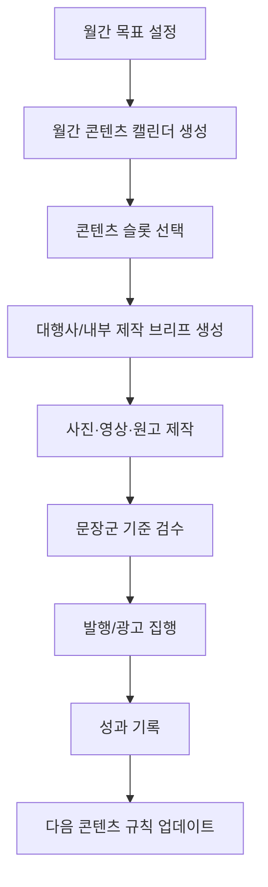

# 문장군 인스타그램 운영 가이드

> 기준 문서: `PRD_인스타엔진_v3.0.md`
> 최종 업데이트: 2026-05-14
> 목적: 문장군 인스타그램을 직접 운영하거나 대행사와 협업할 때 흔들리지 않는 운영 기준을 제공한다.

---

## 1. 운영 원칙

문장군 인스타그램의 1차 목표는 팔로워 증가가 아니라 **무료 실측 예약과 DM 문의 전환**이다.

팔로워, 저장, 공유, 좋아요는 중요하지만 최종 KPI가 아니다. 콘텐츠가 저장되더라도 실측 예약이나 문의로 이어질 수 없는 구조라면 운영 목적에서 벗어난다.

### 핵심 우선순위

1. **신뢰:** 실제 현장, 실제 시공, 실제 상담 맥락을 보여준다.
2. **저장:** 나중에 시공할 때 다시 볼 만한 정보성 콘텐츠를 만든다.
3. **전환:** DM, 프로필 링크, 네이버 예약으로 자연스럽게 이어지게 한다.
4. **학습:** 성과 데이터를 다음 콘텐츠에 반영한다.

---

## 2. 콘텐츠 포트폴리오

월간 콘텐츠는 아래 비율을 기준으로 구성한다. 실제 성과에 따라 매월 조정한다.

| 축 | 권장 비율 | 핵심 목적 | 대표 소재 |
|----|----------|----------|----------|
| 정보성 캐러셀 | 35% | 저장, 신뢰 | 중문 선택법, 방문교체 체크리스트, 추가금 방지 |
| 리얼 현장 숏폼 | 25% | 신뢰, 문의 | 실측 장면, Before/After, 시공 과정 |
| 광고 전환 소재 | 20% | 예약, DM | 무료 실측, 리뷰 신뢰, 추가금 방지 |
| 블로그 파생 콘텐츠 | 10% | 자산 재활용 | 기존 블로그 핵심 요약 |
| 캐릭터/브랜드 친밀도 | 10% | 기억, 친근감 | 문장군 캐릭터 Q&A, 짧은 상황극 |

### 콘텐츠 목적 태그

모든 콘텐츠는 제작 전에 목적 태그를 붙인다.

| 태그 | 목표 | 주요 지표 |
|------|------|----------|
| SAVE | 저장 유도 | 저장수, 캐러셀 완독률 |
| SHARE | 공유 유도 | 공유수, 댓글 태그 |
| TRUST | 신뢰 형성 | 프로필 방문, 팔로우 |
| LEAD | 문의/예약 | DM, 링크 클릭, 네이버 예약 |
| AD | 광고 집행 | CTR, CPC, 문의당 비용 |

---

## 3. 월간 운영 흐름

월간 운영은 `캘린더 → 단건 브리프 → 제작 → 검수 → 발행 → 성과 기록 → 다음 달 반영` 순서로 진행한다.



### 월간 캘린더 필수 필드

| 필드 | 예시 |
|------|------|
| slot_id | 2026-05-W3-003 |
| 예정일 | 2026-05-21 |
| 목적 태그 | SAVE / LEAD |
| 포맷 | carousel / reels / image |
| 주제 | 아파트중문가격 |
| 원천 자료 | 블로그 019, AppSheet 사례, 자유 주제 |
| CTA | 무료 실측 예약 |
| 광고 활용 | Y/N |
| 대행사 브리프 필요 | Y/N |

---

## 4. 대행사 협업 기준

대행사는 제작과 운영을 돕는 파트너지만, 문장군의 브랜드 기준은 내부 문서가 잡는다.

### 대행사에 넘길 수 있는 일

- 월간 콘텐츠 기획 보조
- 피드 톤앤매너 정리
- 디자인 제작
- 촬영 및 편집
- 업로드 대행
- 댓글/DM 1차 응대 초안 작성
- 월간 성과 리포트 작성

### 문장군 내부에서 반드시 잡아야 하는 일

- 제품/서비스 정확성 검수
- 불가 지역 검수
- 가격 표현 검수
- 무료 실측/예약 CTA 방향 확정
- DM 상담 최종 응대
- 시공 가능 여부와 견적 관련 판단

### 대행사 브리프 필수 항목

| 항목 | 내용 |
|------|------|
| 연결 슬롯 | 월간 캘린더 slot_id |
| 콘텐츠 목적 | SAVE / SHARE / TRUST / LEAD / AD |
| 타겟 | 예: 30~40대 아파트 거주자, 중문 고민 고객 |
| 핵심 메시지 | 예: 가격보다 실측이 먼저다 |
| 참고 자료 | 블로그 글, AppSheet 사례, 사진 폴더 |
| 필요한 컷 | Before, After, 실측, 시공 디테일 |
| 금지 표현 | 구체 가격, 최저가, 100% 보장, 보양 작업 |
| CTA | 프로필 링크, 네이버 예약, DM 문의 |
| 검수 기준 | 제품명, 지역, 가격 표현, AI 이미지 사용 여부 |

---

## 5. 콘텐츠 제작 기준

### 정보성 캐러셀

정보성 캐러셀은 저장을 목표로 한다.

구조:
1. 훅: 숫자형/경고형 제목
2. 문제 공감
3. 핵심 정보 1
4. 핵심 정보 2
5. 체크리스트 또는 비교표
6. 문장군 신뢰 근거
7. 저장 + 무료 실측 CTA

금지:
- 단순 광고형 카드
- 시공 사진만 나열
- "상담 문의 주세요"만 반복

### 리얼 현장 숏폼

리얼 현장 숏폼은 AI 이미지보다 실제 사진/영상이 우선이다.

필수 요소:
- 실제 현장 맥락
- 고객 고민
- 실측 또는 시공 판단 포인트
- 결과 또는 해결 방향
- 프로필 링크/무료 실측 CTA

AI 이미지 허용:
- 고민하는 고객
- 일반적인 분위기 장면
- 추상적 상황

AI 이미지 금지:
- 시공 결과물
- 제품 디테일
- 실제 현장처럼 보이는 가짜 Before/After

### 광고 전환 소재

광고 소재는 하나의 메시지만 가져간다.

추천 각도:
- 무료 실측형: "와서 봐도 0원"
- 추가금 방지형: "현장 추가금, 실측에서 먼저 확인"
- 리뷰 신뢰형: "리뷰가 많은 이유"
- 사례 증명형: "좁은 현관도 방법을 찾습니다"
- 속도형: "결정 후 빠른 시공"

---

## 6. DM·댓글 응대 기준

DM과 댓글은 상담 전환의 입구다. 대행사가 1차 응대를 하더라도 최종 상담 판단은 문장군이 한다.

### 기본 응대 흐름

1. 고객 고민 확인
2. 제품/현장 조건 간단히 확인
3. 가격 단정 대신 실측 필요성 안내
4. 무료 방문실측 또는 네이버 예약으로 연결

예시:

```text
현장 구조에 따라 가능한 제품과 견적이 달라질 수 있어서요.
문장군은 방문 실측과 견적이 무료라서, 편하게 한 번 받아보셔도 괜찮습니다.
프로필 링크에서 네이버 예약으로 접수하시면 일정 확인 도와드릴게요.
```

### 가격 문의 응대

```text
제품 종류, 사이즈, 철거 여부, 현장 구조에 따라 견적이 달라질 수 있습니다.
그래서 문장군은 실측 때 추가금 가능 항목까지 먼저 확인해드리고 있어요.
방문 실측은 무료라 부담 없이 예약 잡아보셔도 됩니다.
```

### 지역 문의 응대

```text
문장군 시공 가능 지역은 서울, 인천 일부, 경기 일부, 천안/아산/청주/세종/대전입니다.
일부 제외 지역이 있어서 동네명을 알려주시면 가능 여부를 먼저 확인해드릴게요.
```

### 응대 금지

- 구체 가격 단정
- 불가 지역 가능하다고 답변
- "무조건 됩니다"
- "최저가입니다"
- 보양 작업 언급
- 타 업체 비방

---

## 7. 성과 기록 기준

성과 기록은 복잡하면 안 된다. 최소 필드만 입력해도 학습 루프가 돌아가야 한다.

### 최소 입력 필드

| 필드 | 필수 | 예시 |
|------|------|------|
| content_id | 필수 | 2026-05-W3-003 |
| posted_at | 필수 | 2026-05-21 |
| format | 필수 | carousel |
| purpose_tag | 필수 | SAVE |
| topic | 필수 | 아파트중문가격 |
| saves | 필수 | 42 |
| dm_lead | 필수 | Y |

### 선택 입력 필드

| 필드 | 예시 |
|------|------|
| shares | 8 |
| comments | 3 |
| profile_clicks | 12 |
| reservation_lead | Y |
| ad_spend | 50000 |
| ad_ctr | 1.8% |
| notes | 추가금 훅 반응 좋음 |

### 해석 기준

- 저장수 높음 + DM 없음: 정보성은 좋지만 전환 CTA 약함
- 저장수 낮음 + DM 있음: 적은 도달에서도 구매 의도 강함
- 공유수 높음: 공감형/상황극 확장 가능
- 광고 CTR 높음 + DM 없음: 랜딩/프로필/예약 흐름 점검
- DM 있음 + 예약 없음: 응대 스크립트 또는 예약 동선 점검

---

## 8. 검수 체크리스트

발행 전 아래 항목을 확인한다.

```text
□ 콘텐츠 목적 태그가 있는가?
□ 무료 실측/DM/프로필 링크 중 하나로 CTA가 연결되는가?
□ 제품명이 BRAND_CONTEXT와 일치하는가?
□ 서비스 불가 지역을 가능하다고 표현하지 않았는가?
□ 구체 가격을 단정하지 않았는가?
□ 최저가/100%/무조건 같은 과장 표현이 없는가?
□ 보양 작업을 언급하지 않았는가?
□ 시공 결과물에 AI 이미지를 쓰지 않았는가?
□ 해시태그가 붙여쓰기 형태인가?
□ 대행사 제작물이라면 브리프 기준을 지켰는가?
```

---

## 9. 월간 회고 질문

매월 말 아래 질문에 답하고 다음 달 캘린더에 반영한다.

1. 저장수가 가장 높았던 콘텐츠는 무엇인가?
2. DM 문의가 발생한 콘텐츠는 무엇인가?
3. 예약으로 이어진 콘텐츠가 있었는가?
4. 광고 소재로 쓸 만한 콘텐츠는 무엇인가?
5. AI 느낌 때문에 신뢰를 깎은 콘텐츠가 있었는가?
6. 대행사/내부 제작 과정에서 가장 오래 걸린 병목은 무엇인가?
7. 다음 달에 줄일 포맷과 늘릴 포맷은 무엇인가?

---

## 10. 다음 산출물

이 운영 가이드를 기준으로 다음 문서를 만든다.

1. `instagram/agency_feedback.md`
2. `instagram/monthly_calendar_YYYY_MM.md`
3. `instagram/performance_log.md`
4. `instagram/shooting_requests.md`
5. 인스타엔진 `SKILL.md` v3.0 업데이트 오더
