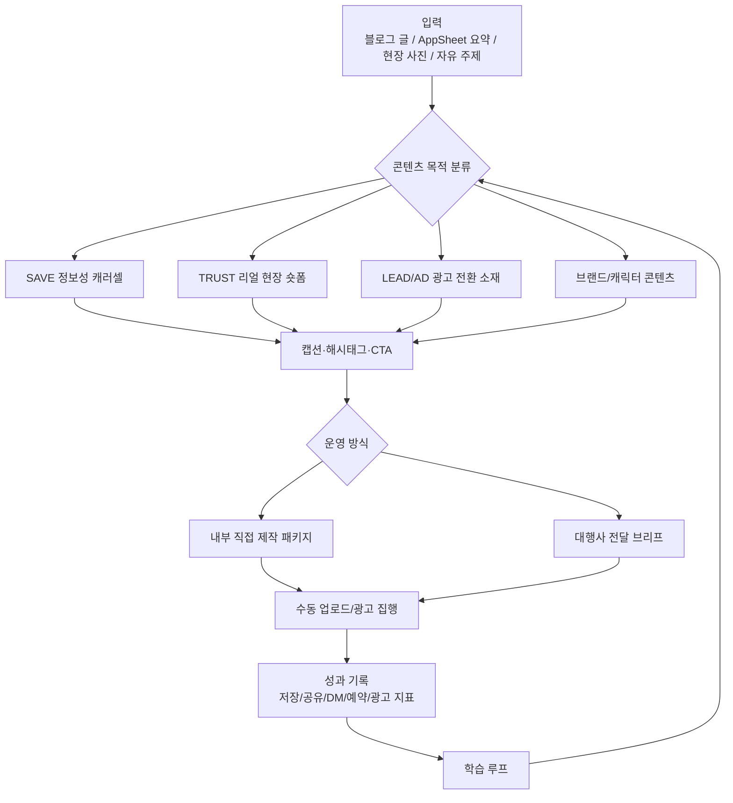

# 문장군 인스타그램 운영 OS — Product Requirements Document

## 1. Executive Summary

- **Vision Statement:** 문장군 인스타그램을 단순 콘텐츠 업로드 채널이 아니라, 정보성 콘텐츠·실제 현장 자산·광고 소재·DM 응대·대행사 협업까지 연결되는 전환형 운영 시스템으로 만든다.
- **Problem Space:** 기존 인스타 운영은 제품/시공 사진과 AI 영상 중심이라 신뢰와 전환을 만들기 어렵다. 대행사 피드백 역시 단순 업로드보다 정보성 콘텐츠, 실제 현장감, 광고 병행, 응대 프로세스가 필요하다는 쪽으로 모였다.
- **Target Persona & Context:** 문장군 내부 마케팅 운영자와 향후 협업 대행사. 블로그 SEO 시스템은 이미 가동 중이며, AppSheet 현장 데이터와 시공 사진, 리뷰 자산을 인스타 전환 구조로 재활용해야 한다.

### v2.0 → v3.0 피벗 이유

| 항목 | v2.0 | v3.0 |
|------|------|------|
| 제품 정의 | 숏폼·캐러셀 제작 엔진 | 인스타그램 운영 OS |
| 핵심 목표 | 제작 시간 50% 단축 | DM 문의·무료 실측 예약 전환 |
| 운영 방식 | 내부 제작 자동화 중심 | 내부 운영 + 대행사 협업 둘 다 가능 |
| 콘텐츠 기준 | TTS 숏폼, 데이터 캐러셀, 블로그 파생 | 정보성, 리얼 현장, 광고 소재, DM 유도, 캐릭터/브랜드 친밀도 |
| 품질 기준 | 패키지 완성도 | 신뢰도, 전환성, 광고 활용성, 협업 가능성 |

---

## 2. Jobs-to-be-Done

- **Functional Job:** 운영자가 블로그 글, AppSheet 현장 데이터, 시공 사진, 대행사 피드백을 입력하면 인스타 콘텐츠 기획안, 제작 패키지, 광고 소재 후보, DM 응대 가이드, 대행사 전달 브리프가 나온다.
- **Emotional Job:** "인스타도 해야 하는데 뭘 올려야 하지?"라는 부담을 줄이고, 내부 운영이든 대행사 협업이든 문장군 기준으로 흔들리지 않는 안심감을 준다.
- **Social Job:** 문장군 인스타그램이 "광고 계정"이 아니라 "중문·방문 시공을 맡기기 전에 참고하는 전문 채널"로 인식되게 한다.

---

## 3. Strategic Constraints

> 아래 제약은 인스타엔진, 블로그엔진, 대행사 협업 문서가 모두 따라야 하는 Hard Hooks다.

- **운영 모델:** 직접 운영 가능한 구조가 우선이며, 같은 산출물이 대행사 전달용 브리프가 될 수 있어야 한다.
- **1차 KPI:** 팔로워 수가 아니라 `DM 문의`, `무료 실측 예약`, `프로필 링크 클릭`, `네이버 예약 유입`이다.
- **중간 KPI:** 저장, 공유, 재생완료율, 댓글, 광고 CTR, CPC, 콘텐츠별 문의 기여도.
- **AI 이미지 제한:** 고민하는 사람·상황 이미지 등 추상적 장면만 허용. 시공 결과물, 제품 디테일, 현장 전문성 장면은 AppSheet 실제 사진/영상 우선.
- **제품 정확성:** BRAND_CONTEXT의 제품 라인업과 서비스 지역을 벗어나면 안 된다.
- **가격 표현:** 구체 가격 단정 금지. "무료 실측 후 정확한 견적" 방향으로 안내한다.
- **자동화 범위:** 인스타그램 API 자동 업로드, DM 자동응답, 광고 API 자동집행은 MVP에서 제외한다.

---

## 4. Agency Feedback Synthesis

대행사 피드백은 기능 요구사항이 아니라 전략 입력값으로 반영한다.

| 피드백 출처 | 핵심 인사이트 | PRD 반영 |
|-------------|---------------|----------|
| 소셜링 | 브랜딩 중심 운영은 최소 6개월 단위로 봐야 하며, 채널 운영·콘텐츠 제작·댓글 응대·타겟 활동이 묶여야 함 | 월간 운영 캘린더, 리포트, 커뮤니케이션 기준 추가 |
| 에이달 | 정보성 캐러셀 + 광고 병행이 문장군에 적합. DM 응대는 문장군 직접 권장 | 콘텐츠 목적 분류, 광고 소재 후보, DM 응대 가이드 추가 |
| 아이써치마케팅 | AI 영상 이질감이 신뢰를 떨어뜨림. 실제 시공 전후, 현장 전문가, 캐릭터 활용 필요 | 리얼 현장 자산 우선, 캐릭터/브랜드 친밀도 콘텐츠 추가 |
| 킨다그로스 | 단순 운영만으로 전환은 어렵고, 프로모션·광고·인플루언서 등 전환 액션이 필요 | 광고/전환 실험 시스템과 프로모션 슬롯 추가 |

---

## 5. Content Strategy

### 5.1 콘텐츠 포트폴리오

| 축 | 비율 | 목적 | 대표 포맷 |
|----|------|------|----------|
| 정보성 캐러셀 | 35% | 저장·신뢰·능동 고객 축적 | "중문 고르기 3가지", "방문교체 전 체크리스트" |
| 리얼 현장 숏폼 | 25% | 신뢰·문의 유도 | Before/After, 실측 장면, 시공 프로세스 |
| 광고 전환 소재 | 20% | 단기 문의·예약 전환 | 무료 실측, 추가금 방지, 리뷰 신뢰 소재 |
| 블로그 파생 콘텐츠 | 10% | SEO 자산 재활용 | 기존 글 핵심 요약 캐러셀/릴스 |
| 캐릭터/브랜드 친밀도 | 10% | 브랜드 기억·부담 완화 | 문장군 캐릭터 Q&A, 짧은 상황극 |

### 5.2 콘텐츠 목적 태그

모든 콘텐츠는 제작 전 아래 목적 중 하나를 반드시 가진다.

| 태그 | 목표 | 성공 신호 |
|------|------|----------|
| SAVE | 저장 유도 | 저장수, 캐러셀 완독률 |
| SHARE | 공유 유도 | DM 공유, 댓글 태그 |
| TRUST | 신뢰 형성 | 프로필 방문, 팔로우 |
| LEAD | 문의/예약 유도 | DM, 링크 클릭, 네이버 예약 |
| AD | 광고 집행 소재 | CTR, CPC, 문의당 비용 |

---

## 6. Features & Execution Scope

### 🟢 Must Have

#### [F-001] 콘텐츠 전략 분류 엔진

- **Context:** 모든 인스타 콘텐츠를 "예쁜 게시물"이 아니라 목적 있는 마케팅 자산으로 분류한다.
- **Machine-Verifiable Criteria:**
  - `Given` 주제, 원본 블로그 글, AppSheet 요약 중 하나가 입력됨
  - `When` 콘텐츠 기획을 실행함
  - `Then` `SAVE/SHARE/TRUST/LEAD/AD` 중 하나 이상의 목적 태그와 추천 포맷이 출력됨
  - `Then` 콘텐츠가 정보성 캐러셀, 리얼 현장 숏폼, 광고 소재, 블로그 파생, 캐릭터 콘텐츠 중 하나로 분류됨

#### [F-002] 정보성 캐러셀 생성

- **Context:** 대행사들이 공통으로 제안한 "정보형 콘텐츠"를 문장군의 핵심 성장 포맷으로 만든다.
- **Machine-Verifiable Criteria:**
  - `Given` 키워드 또는 블로그 글이 입력됨
  - `When` 정보성 캐러셀 생성을 실행함
  - `Then` 캐러셀 단독 요청 시, 서브폴더 없이 `instagram/content/NNN_테마명.html` 형태로 단일 HTML 파일을 생성함
  - `Then` 캐러셀 HTML 파일은 총 7장 구성으로 강제하며, 1~6장은 기존 캐러셀 디자인, 7번째 슬라이드에는 직관적으로 복사할 수 있는 본문 캡션 및 해시태그 복사 카드 UI가 탑재됨
  - `Then` 7번째 슬라이드는 '캡션 복사' 단추를 지니며, JavaScript를 통해 클립보드 복사 기능을 제공함
  - `Then` 첫 장은 저장/공유 욕구를 만드는 숫자형 또는 경고형 훅이어야 함
  - `Then` 마지막 장(7번째)은 본문 캡션 내에 "📌 저장"과 "무료 실측은 프로필 링크" CTA를 포함함

#### [F-003] 리얼 현장 숏폼 패키지 생성

- **Context:** AI 영상 이질감을 줄이고 실제 현장 신뢰를 강화한다.
- **Machine-Verifiable Criteria:**
  - `Given` AppSheet 현장 요약, 실제 사진 설명, 블로그 사례 중 하나가 입력됨
  - `When` 숏폼 패키지를 생성함
  - `Then` 30~39초 이하 대본, 씬별 실사진 요구사항, 자막, 캡션, 음악 추천이 생성됨
  - `Then` 시공 결과물/제품 디테일 씬은 반드시 `[실사진/실영상 필요]`로 표시됨
  - `Then` AI 이미지 프롬프트가 필요한 경우 "no text"가 포함되고 제품 디테일을 생성하지 않음

#### [F-004] 광고 소재 후보 생성

- **Context:** 인스타 운영만으로 즉시 전환을 기대하기 어렵기 때문에 Meta 광고 소재로도 쓸 수 있는 콘텐츠가 필요하다.
- **Machine-Verifiable Criteria:**
  - `Given` 콘텐츠 주제 또는 발행 완료 콘텐츠가 입력됨
  - `When` 광고 소재 후보 생성을 실행함
  - `Then` 3개 이상의 광고 훅, 3개 이상의 썸네일/첫 화면 카피, CTA 문구가 출력됨
  - `Then` 각 후보는 `문제공감형`, `무료실측형`, `추가금방지형`, `리뷰신뢰형`, `사례증명형` 중 하나로 분류됨

#### [F-005] DM·댓글 응대 가이드 생성

- **Context:** 대행사 피드백상 DM 응대는 전환과 직결되므로 문장군 기준이 필요하다.
- **Machine-Verifiable Criteria:**
  - `Given` 콘텐츠 주제와 예상 질문이 입력됨
  - `When` 응대 가이드를 생성함
  - `Then` 댓글 답변 5개, DM 1차 응대 5개, 네이버 예약 유도 문구 3개가 생성됨
  - `Then` 가격 단정, 불가 지역 가능 표현, 과장 보장은 포함되지 않음
  - `Then` "상담/실측 예약으로 넘기는 기준"이 명시됨

#### [F-006] 대행사 전달 브리프 생성

- **Context:** 직접 운영과 대행사 협업을 동시에 지원해야 한다.
- **Workflow Position:** 월간 캘린더(F-007)에서 확정된 각 콘텐츠 슬롯을 실행 단위로 쪼갤 때 생성되는 단건 작업 문서다. 즉, `월간 캘린더 → 슬롯 선택 → 대행사 브리프 생성 → 제작/촬영/검수` 순서로 연결된다.
- **Machine-Verifiable Criteria:**
  - `Given` 월간 콘텐츠 목표 또는 단건 콘텐츠 주제가 입력됨
  - `When` 대행사 브리프 생성을 실행함
  - `Then` 목표, 타겟, 핵심 메시지, 금지 표현, 참고 블로그 글, 필요 사진/촬영 컷, CTA, 검수 기준이 포함된 브리프가 생성됨
  - `Then` 브리프에는 연결된 월간 캘린더 슬롯 ID 또는 콘텐츠 번호가 포함됨

#### [F-007] 월간 운영 캘린더 생성

- **Context:** 콘텐츠가 단건으로 흩어지지 않고 6개월 운영 관점에서 누적되어야 한다.
- **Workflow Position:** 월간 캘린더는 인스타 운영의 상위 계획표이며, 대행사 브리프(F-006)는 캘린더 안의 개별 슬롯을 실행하기 위한 하위 산출물이다.
- **Machine-Verifiable Criteria:**
  - `Given` 월간 목표와 발행 가능 수량이 입력됨
  - `When` 캘린더 생성을 실행함
  - `Then` 최소 4주치 콘텐츠 계획이 생성됨
  - `Then` 각 콘텐츠는 슬롯 ID, 목적 태그, 포맷, 원천 자료, CTA, 광고 활용 여부, 대행사 브리프 필요 여부를 포함함

#### [F-008] 성과 기록 및 학습 루프

- **Context:** 블로그 순위 추적처럼 인스타도 저장/공유/문의 데이터를 다음 콘텐츠에 반영해야 한다.
- **Minimum Input Schema:** 성과 입력은 최소 아래 필드를 포함해야 한다. 일부 고급 지표가 없어도 최소 필드만 있으면 학습 루프가 작동해야 한다.

| 필드 | 필수 | 예시 | 설명 |
|------|------|------|------|
| content_id | 필수 | 2026-05-W3-003 | 월간 캘린더 슬롯 ID 또는 게시물 식별자 |
| posted_at | 필수 | 2026-05-21 | 게시일 |
| format | 필수 | carousel / reels / image | 콘텐츠 포맷 |
| purpose_tag | 필수 | SAVE / SHARE / TRUST / LEAD / AD | 콘텐츠 목적 태그 |
| topic | 필수 | 아파트중문가격 | 주제 또는 키워드 |
| saves | 필수 | 42 | 저장수 |
| shares | 선택 | 8 | 공유수. 없으면 blank 허용 |
| comments | 선택 | 3 | 댓글수. 없으면 blank 허용 |
| profile_clicks | 선택 | 12 | 프로필 방문/링크 클릭 관련 수치 |
| dm_lead | 필수 | Y / N | DM 문의 기여 여부 |
| reservation_lead | 선택 | Y / N | 무료 실측 예약 기여 여부. 추적 가능할 때만 입력 |
| ad_spend | 선택 | 50000 | 광고 집행 시 광고비 |
| ad_ctr | 선택 | 1.8% | 광고 집행 시 CTR |
| notes | 선택 | "추가금 훅 반응 좋음" | 정성 메모 |

- **Machine-Verifiable Criteria:**
  - `Given` 최소 입력 필드를 포함한 콘텐츠별 성과 데이터가 입력됨
  - `When` 성과 분석을 실행함
  - `Then` 상위 콘텐츠의 훅, 포맷, CTA, 소재 유형이 요약됨
  - `Then` 다음 주 콘텐츠에 반영할 규칙 3개 이상이 제안됨
  - `Then` 저장수 기준 상위 콘텐츠와 DM/예약 기여 콘텐츠를 분리해 해석함

### 🟡 Should Have

- **[F-101] 촬영 요청서 생성** — 대행사/내부 담당자가 찍어야 할 실측, 제품, Before/After, 전문가 컷 리스트 생성.
- **[F-102] 캐릭터 콘텐츠 엔진** — 문장군 캐릭터를 활용한 Q&A, 실수 방지, 친근형 콘텐츠 생성.
- **[F-103] 프로모션 슬롯 관리** — 리뷰 이벤트, 무료 실측, 시즌성 혜택을 콘텐츠 캘린더에 반영.
- **[F-104] 경쟁/레퍼런스 계정 분석 템플릿** — 대림바스, 오늘의집 등 레퍼런스 운영 구조를 수동 분석해 기록.
- **[F-105] 광고 성과 대시보드** — 광고비, CPC, CTR, DM 문의, 예약 전환을 콘텐츠별로 기록.

### 🔴 Explicitly Out-of-Scope

- **[X-001] 인스타그램 자동 업로드/API 연동:** MVP에서는 수동 업로드. 계정 리스크와 구현 복잡도 때문에 제외.
- **[X-002] DM 자동응답 봇 구축:** 상담 품질과 견적 리스크 때문에 제외. 응대 가이드만 생성.
- **[X-003] Meta 광고 자동 집행:** 광고 소재와 카피까지만 생성. 집행은 사용자 또는 대행사 영역.
- **[X-004] 실제 촬영 자동화:** 촬영 요청서만 생성. 촬영 자체는 내부 또는 대행사 수행.
- **[X-005] 구체 가격/견적 자동 산출:** 실측 전 가격 단정 금지. 견적은 문장군 상담/실측 프로세스로 연결.
- **[X-006] 팔로워 수만을 목표로 한 이벤트 남발:** 유령 팔로워 유입을 막기 위해 전환과 저장 중심으로 운영.

---

## 7. Topological Context

### 7.1 Operating Flow



### 7.2 Output Structure

```
문장군 인스타그램/
├── PRD_인스타엔진_v3.0.md
├── INSTAGRAM_OPERATING_GUIDE.md          ← 운영 원칙, KPI, DM 기준
├── instagram/
│   ├── monthly_calendar_YYYY_MM.md
│   ├── performance_log.md
│   ├── agency_feedback.md
│   └── content/
│       ├── 001_좁은현관의기적/             ← (숏폼/패키지 제작용 레거시 폴더)
│       │   ├── shortform_package.md
│       │   ├── shortform.wav
│       │   └── shortform.srt
│       ├── 009_담당매니저실측브이로그.html  ← (캐러셀 단독 제작 시 직속 파일 구조)
│       └── 010_화장실문밑동썩음주의보.html
```

---

## 8. AI Evals & Quality Gates

- [ ] **EVAL-01:** 모든 콘텐츠에 목적 태그가 있는가?
- [ ] **EVAL-02:** 콘텐츠 CTA가 무료 실측 예약/DM 문의/프로필 링크 중 하나로 연결되는가?
- [ ] **EVAL-03:** 시공 결과물·제품 디테일에 AI 이미지 사용을 지시하지 않았는가?
- [ ] **EVAL-04:** BRAND_CONTEXT의 제품명과 서비스 지역을 벗어나지 않았는가?
- [ ] **EVAL-05:** 구체 가격 단정, 최저가, 100% 보장, 보양 작업 표현이 없는가?
- [ ] **EVAL-06:** 대행사 브리프에 목표, 금지사항, 필요 자료, 검수 기준이 포함됐는가?
- [ ] **EVAL-07:** 광고 소재 후보가 최소 3개 이상 생성됐는가?
- [ ] **EVAL-08:** DM 응대 가이드가 예약 전환으로 자연스럽게 이어지는가?
- [ ] **EVAL-09:** 성과 기록 항목이 다음 콘텐츠 개선에 연결되는가?
- [ ] **EVAL-10:** Out-of-Scope 기능이 구현되거나 지시되지 않았는가?

---

## 9. Implementation Phases

### Phase 0: 전략 문서 정비
- [ ] `PRD_인스타엔진_v3.0.md` 확정
- [ ] `INSTAGRAM_OPERATING_GUIDE.md` 생성
- [ ] 기존 `인스타엔진/SKILL.md`의 저장 규칙 불일치 정리
- [ ] 대행사 피드백을 `instagram/agency_feedback.md`로 정리

### Phase 1: 직접 운영 MVP
- [ ] 콘텐츠 목적 분류 엔진 규칙 추가
- [ ] 정보성 캐러셀 생성 모드 추가
- [ ] 리얼 현장 숏폼 패키지 생성 모드 정리
- [ ] DM·댓글 응대 가이드 출력 추가
- [ ] 단건 콘텐츠 3개로 테스트

### Phase 2: 대행사 협업 패키지
- [ ] 대행사 전달 브리프 템플릿 생성
- [ ] 촬영 요청서 템플릿 생성
- [ ] 월간 콘텐츠 캘린더 생성
- [ ] 검수 체크리스트 생성

### Phase 3: 광고 전환 실험
- [ ] 광고 소재 후보 생성 모드 추가
- [ ] 무료 실측/추가금 방지/리뷰 신뢰/사례 증명 카피 세트 생성
- [ ] 콘텐츠별 광고 활용 여부 기록
- [ ] 광고 결과 수동 입력 템플릿 생성

### Phase 4: 성과 학습 루프
- [ ] `instagram/performance_log.md` 운영
- [ ] 주간 성과 요약 생성
- [ ] 다음 주 콘텐츠 규칙 업데이트
- [ ] 고성과 훅/CTA/포맷 라이브러리 구축

---

## 10. KPI Framework

### 10.1 Primary KPI

| KPI | 측정 방식 | 목표 |
|-----|----------|------|
| DM 문의 | 수동 카운트 | 월별 증가 추세 |
| 무료 실측 예약 | 네이버 예약/내부 기록 | 콘텐츠별 기여도 기록 |
| 프로필 링크 클릭 | 인스타 인사이트 | 월별 증가 추세 |
| 광고 문의당 비용 | 광고비 ÷ 문의 수 | 소재별 비교 |

### 10.2 Secondary KPI

| KPI | 의미 |
|-----|------|
| 저장수 | 정보성 콘텐츠 품질 |
| 공유수 | 공감·화제성 |
| 재생완료율 | 숏폼 흡입력 |
| 댓글수 | 참여도 |
| 팔로워 순증 | 채널 신뢰 축적 |

---

## 11. Operating Principles

1. **팔로워보다 문의가 먼저다.** 팔로워는 중간지표이고 최종 목적은 무료 실측 예약과 DM 문의다.
2. **AI 느낌보다 실제 현장감이 우선이다.** AI 이미지는 감정 장면에만 쓰고, 제품·시공은 실제 자산을 쓴다.
3. **정보성 콘텐츠가 신뢰의 입구다.** 저장할 만한 글이 쌓여야 광고도 설득력을 얻는다.
4. **광고와 콘텐츠는 분리하지 않는다.** 모든 콘텐츠는 광고 소재로 확장 가능한지 검토한다.
5. **대행사를 써도 기준은 문장군이 가진다.** 브리프, 금지어, 검수표, 응대 기준은 내부 시스템에서 나온다.

---

## 12. Change Log

| 버전 | 날짜 | 변경 내용 |
|------|------|----------|
| v3.0.1 | 2026-05-14 | Claude 피드백 반영. F-008 성과 학습 루프 최소 입력 스키마 추가, F-006 대행사 브리프와 F-007 월간 캘린더의 상하위 워크플로우 관계 명시. |
| v3.0.0 | 2026-05-14 | 대행사 피드백 반영. 제작 엔진에서 인스타그램 운영 OS로 피벗. 직접 운영 + 대행사 협업, DM/무료 실측 예약 KPI 확정. |
