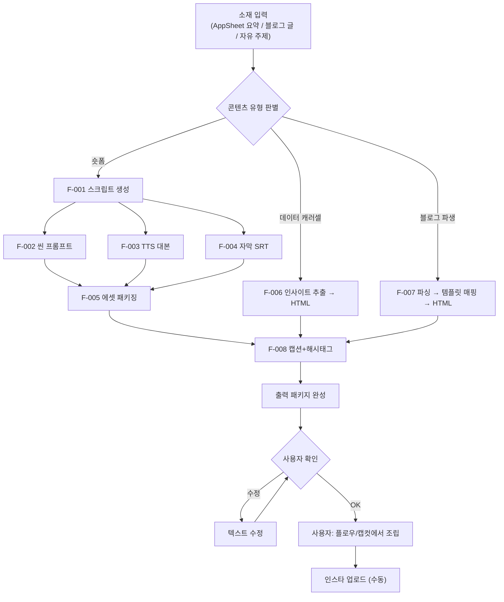

# 인스타엔진 v2.0 — Product Requirements Document

## 1. Executive Summary

- **Vision Statement:** 블로그엔진이 블로그 글을 찍어내듯, 인스타엔진은 숏폼·캐러셀 소재를 찍어낸다. 제작 시간 50% 단축.
- **Problem Space:** TTS 대화형 숏폼이 CPC 150원/CTR 10%+로 검증되었으나, 도구 6개를 수동으로 넘나들어 양산 불가. 시스템화가 핵심 과제.
- **Target Persona & Context:** 문장군 마케팅 운영자(바이브코더). 블로그 일 4~7편 발행 중. AI 도구(나노바나나, 플로우, 제미나이) 활용 능숙. 시스템만 갖추면 인스타도 일 1~2개 가능.

### v1.0 → v2.0 변경 이유

| 항목 | v1.0 | v2.0 |
|------|------|------|
| 범위 | 블로그→캐러셀만 | TTS 숏폼 + 데이터 캐러셀 + 블로그 파생 |
| 핵심 입력 | 블로그 글 | AppSheet 데이터 + 블로그 글 + 자유 주제 |
| 킬러 포맷 | 캐러셀 | TTS 대화형 숏폼 (검증됨) |
| 계정 전략 | 미포함 | 새 계정 + 프로필 최적화 + KPI |

---

## 2. Jobs-to-be-Done

- **Functional Job:** "인스타 숏폼 만들어줘"라고 하면 스크립트+TTS 대본+씬 프롬프트+자막+캡션이 규격화된 패키지로 나온다.
- **Emotional Job:** "블로그도 인스타도 해야 하는데..." 부담감 해소. 한 번의 기획으로 두 채널 커버.
- **Social Job:** 문장군 인스타가 전문적이고 일관된 브랜드 → "여기 제대로 하는 곳이네" 인식.

---

## 3. Architectural Constraints

> ⚠️ AI 에이전트가 절대 위배해서는 안 되는 Hard Hooks

- **형태:** 안티그래비티 스킬 (SKILL.md) — 블로그엔진과 동급
- **위치:** `skills/인스타엔진/SKILL.md`
- **브랜드 참조:** `문장군블로그/BRAND_CONTEXT.md` 공유
- **기존 자산:** `인스타그램 카드뉴스 자동생성기/` 폴더의 templates, styles, capture.js 재사용
- **CRITICAL RULES:**
  - 기존 HTML 템플릿(type-a/b/c)의 구조(태그, 클래스) 변경 금지
  - `✏️ EDIT` 주석이 있는 텍스트만 수정
  - **AI 이미지 사용 범위 규칙 (감찰 반영):**
    - ✅ 추상적 상황(고민하는 사람, 분위기 배경): AI 이미지 허용
    - ❌ 시공 결과물/제품 디테일: 반드시 AppSheet 실제 사진 사용
    - AI 생성 이미지 프롬프트에 텍스트/글자 넣지 않음 ("no text" 필수)
  - 슬라이드 사이즈: 1080×1350px (4:5) 고정 (캐러셀)
  - 숏폼 길이: 30초 이하

---

## 4. Features & Execution Scope

### 🟢 Must Have (MVP)

#### [F-001] TTS 대화형 숏폼 스크립트 생성

- **Context:** 검증된 킬러 포맷. 고객(여)+문장군(남) 대화 구조의 30초 숏폼 대본 자동 생성
- **Machine-Verifiable Criteria:**
  - `Given` 소재 입력 (AppSheet 현장 데이터 요약 or 블로그 글 경로 or 자유 주제)
  - `When` 스크립트 생성 실행
  - `Then` 아래 구조의 대본이 생성됨:
    - 오프닝 훅 (3초 이내, 시선 강탈)
    - 고객 페인포인트 제시 (고객 TTS)
    - 문장군 해결 과정 (문장군 TTS)
    - CTA (프로필 링크 유도)
    - 총 대사 10~15문장, 30초 이내 분량
    - 고객/문장군 역할 구분 명시

#### [F-002] 씬별 프롬프트 패키지 생성

- **Context:** 스크립트의 각 씬에 맞는 시각 소재를 생성하기 위한 프롬프트
- **Machine-Verifiable Criteria:**
  - `Given` F-001에서 생성된 스크립트
  - `When` 프롬프트 생성 실행
  - `Then` 씬별로 두 가지 프롬프트가 생성됨:
    - **이미지 프롬프트:** 구글 플로우/나노바나나용 (영문, "no text" 포함)
    - **영상 변환 프롬프트:** 이미지→영상 변환용 (카메라 무브먼트, 효과 지시)
    - AppSheet에 실제 사진이 있는 씬은 "실사진 사용" 명시 + Ken Burns 효과 프롬프트만
    - AI 이미지가 필요한 씬은 추상적 상황만 (제품 디테일 금지)
    - **Fallback 규칙 (감찰 #2 반영):** AI 이미지 생성 실패(부적절한 결과물) 시 → AppSheet 현장 기본 사진으로 대체. assembly_guide.md에 "이 씬은 실사진 대체 가능" 여부 명시

#### [F-003] TTS 대본 구조화

- **Context:** 제미나이 TTS에 바로 입력할 수 있는 형태로 대본 분리
- **Machine-Verifiable Criteria:**
  - `Given` F-001 스크립트
  - `When` TTS 대본 생성
  - `Then` 역할별 분리된 대본 파일 생성:
    - `audio_customer.txt`: 고객 대사만 (순서대로)
    - `audio_munjang.txt`: 문장군 대사만 (순서대로)
    - 각 대사에 감정 톤 지시 포함 (예: [걱정스럽게], [자신있게])

#### [F-004] 자막 생성

- **Context:** 편집 시 자막 삽입을 위한 타이밍 포함 자막 파일
- **Machine-Verifiable Criteria:**
  - `Given` F-001 스크립트
  - `When` 자막 생성
  - `Then` SRT 형식 자막 파일 생성:
    - 각 대사의 시작/종료 타임스탬프
    - 화자 구분 (고객/문장군)
    - 핵심 키워드 강조 표시

#### [F-005] 에셋 패키징 (감찰 반영)

- **Context:** 생성된 모든 에셋을 규격화된 폴더에 정리하여 사용자 조립 시간 최소화
- **Machine-Verifiable Criteria:**
  - `Given` F-001~F-004 + F-008 출력물
  - `When` 패키징 실행
  - `Then` 아래 구조의 폴더 생성:

```
posts/NNN_키워드/instagram/
├── shortform/
│   ├── script.md              ← 전체 대본 (연출 노트 포함)
│   ├── audio_customer.txt     ← 고객 TTS 대본
│   ├── audio_munjang.txt      ← 문장군 TTS 대본
│   ├── scene_01_img_prompt.txt ← 씬1 이미지 프롬프트
│   ├── scene_01_vid_prompt.txt ← 씬1 영상 변환 프롬프트
│   ├── scene_02_img_prompt.txt
│   ├── ...
│   ├── subtitle.srt            ← 자막 파일
│   └── assembly_guide.md       ← 조립 가이드 (순서, 도구별 작업 지시)
├── caption.txt                 ← 인스타 캡션 + 해시태그
└── music_recommend.txt         ← 음악 추천
```

#### [F-006] 데이터 인사이트 캐러셀 생성

- **Context:** AppSheet 실데이터 기반 "~TOP 3", "~공개" 캐러셀
- **Machine-Verifiable Criteria:**
  - `Given` 사용자가 AppSheet 데이터 요약을 입력 (또는 CSV 붙여넣기)
  - `When` 인사이트 캐러셀 생성 실행
  - `Then` 5~8장 캐러셀 생성:
    - [1장] 훅 — 데이터 기반 제목 (숫자 필수)
    - [2~4장] 핵심 인사이트 (실수치 포함)
    - [5장] 브랜드 — "문장군은?" + 강점
    - [6장] CTA — "📌 저장하고 시공할 때 꺼내보세요" + "견적은 프로필 링크"
    - HTML 파일(render.html)로 출력 (기존 base.css 활용)
    - caption.txt + music_recommend.txt 함께 생성

#### [F-007] 블로그 파생 캐러셀 생성

- **Context:** 블로그 글 핵심 내용을 캐러셀로 재가공
- **Machine-Verifiable Criteria:**
  - `Given` posts/ 폴더의 블로그 글 경로
  - `When` 블로그 파생 캐러셀 생성 실행
  - `Then` 글 유형에 따라 템플릿 자동 선택:

| 블로그 유형 | 캐러셀 템플릿 |
|------------|-------------|
| 가격/비용 | type-a-anxiety |
| 고객 사례 | type-b-empathy |
| 비교/가이드 | type-c-expert |
| 정보/체크리스트 | type-d-info (신규) |

  - 5~6장 캐러셀 HTML + caption.txt + music_recommend.txt 생성

#### [F-008] 인스타 캡션 + 해시태그 생성

- **Context:** 플랫폼에 맞는 캡션과 해시태그
- **Machine-Verifiable Criteria:**
  - `Given` 콘텐츠 내용 + BRAND_CONTEXT.md
  - `When` 캡션 생성
  - `Then` 아래 구조:
    - [1줄 후킹 — 이모지, 궁금증 유발]
    - [2~3줄 본문 요약]
    - [CTA — "견적은 프로필 링크에서!" / "DM으로 문의"]
    - 해시태그 20~25개 (대형5 + 중형10 + 소형+브랜드 5~10)
    - 캡션 길이 150~300자
    - 광고 느낌 배제

#### [F-009] 정보형 캐러셀 템플릿 (신규)

- **Context:** 기존 3종은 마케팅 중심. 정보성 블로그에서 파생되는 나열형 캐러셀 필요
- **Machine-Verifiable Criteria:**
  - `Given` 기존 base.css 디자인 시스템
  - `When` 정보형 캐러셀 요청
  - `Then` type-d-info.html 템플릿 사용:
    - 6장 구조: 훅 → 포인트×3 → 브랜드 → CTA
    - base.css 기존 클래스만 사용
    - 사진 의존 없이 텍스트+디자인으로 완결

### 🟡 Should Have (v2.1 후속)

- **[F-101] 음악 추천 고도화** — 톤별 인스타 음악 검색어 + BPM 매칭
- **[F-102] 비포/애프터 캐러셀 템플릿** — AppSheet 시공사진 활용 스와이프형
- **[F-103] PNG 자동 렌더링** — capture.js 스킬 워크플로우 내장
- **[F-104] 캐러셀 품질 채점** — 블로그엔진 ENGINE 7처럼 자동 채점
- **[F-105] 캡컷 템플릿 사전 제작** — 에셋 원클릭 적용
- **[F-106] AppSheet CSV 배치 처리** — 월간 데이터 자동 인사이트 추출
- **[F-107] HyperFrames 영상 렌더링 연동 (감찰 #2 핵심)** — 에셋 패키지 → HyperFrames HTML 영상 → 브라우저 렌더링 → .webm/.mp4 자동 출력. 캡컷 수동 조립 의존도 제거. 기존 HyperFrames 스킬과 연결.
- **[F-108] 성과 학습 루프 (감찰 #2 반영)** — 월간 TOP 5 고성과 콘텐츠의 스크립트 구조/훅 패턴/CTA 방식을 분석하여, 다음 달 스크립트 생성 규칙에 반영. 블로그엔진의 피드백 루프(순위추적→분석→리라이팅)와 동일한 패턴.

### 🔴 Explicitly Out-of-Scope (절대 구현 금지)

- **[X-001]** 인스타그램 API 연동 / 자동 포스팅: 수동 업로드가 현재 워크플로우
- **[X-002]** 캡컷 자동 편집 / 영상 렌더링: 외부 도구 영역. 스킬은 소재만 생성
- **[X-003]** DM 챗봇(ManyChat 등) 자동화: 현 단계 과도. 수동 DM 응대로 충분
- **[X-004]** AppSheet API 자동 연동: Phase 1은 수동 입력. 자동화는 F-106에서
- **[X-005]** 팔로워 분석 / 성장 추적 / 유령 정리: 인스타 전략 컨설팅은 별도
- **[X-006]** 기존 템플릿(type-a/b/c) HTML 구조 변경: 텍스트만 수정
- **[X-007]** 릴스 영상 촬영/직접 편집: 숏폼 소재 생성까지만. 조립은 사용자

---

## 5. Topological Context

### 5.1 System Flow



### 5.2 파일 구조

```
문장군블로그/                           ← 블로그 워크스페이스
├── posts/
│   └── NNN_키워드/
│       ├── NNN_키워드.md              ← 블로그 글
│       └── instagram/                  ← 인스타엔진 출력
│           ├── shortform/              ← 숏폼 에셋 패키지
│           │   ├── script.md
│           │   ├── audio_customer.txt
│           │   ├── audio_munjang.txt
│           │   ├── scene_NN_img_prompt.txt
│           │   ├── scene_NN_vid_prompt.txt
│           │   ├── subtitle.srt
│           │   └── assembly_guide.md
│           ├── carousel/               ← 캐러셀 (있을 경우)
│           │   └── render.html
│           ├── caption.txt
│           └── music_recommend.txt
│
├── instagram-assets/                   ← 기존 자산 복사 (워크스페이스 통합)
│   ├── templates/
│   │   ├── type-a-anxiety.html
│   │   ├── type-b-empathy.html
│   │   ├── type-c-expert.html
│   │   └── type-d-info.html           ← 신규
│   ├── styles/base.css
│   ├── capture.js
│   └── 문장군 로고 1000 스퀘어.png
│
skills/인스타엔진/
└── SKILL.md                            ← 스킬 정의 문서
```

---

## 6. AI Evals & Quality Gates

- [ ] **EVAL-01:** 숏폼 스크립트가 30초 이내 분량인가? (대사 10~15문장)
- [ ] **EVAL-02:** AI 이미지 프롬프트가 시공 결과물/제품 디테일을 생성하지 않는가?
- [ ] **EVAL-03:** 실사진 사용 가능 씬에서 "실사진 사용" 명시가 되어 있는가?
- [ ] **EVAL-04:** 캡션에 BRAND_CONTEXT 금지 표현이 없는가?
- [ ] **EVAL-05:** 해시태그 20~25개, 모두 붙여쓰기인가?
- [ ] **EVAL-06:** 에셋 패키지가 규격 폴더 구조를 따르는가?
- [ ] **EVAL-07:** CTA에 "프로필 링크" 유도가 포함되어 있는가?
- [ ] **EVAL-08:** Out-of-Scope 기능이 구현되지 않았는가?
- [ ] **EVAL-09:** 캐러셀 HTML이 기존 템플릿 구조를 변경하지 않았는가?

---

## 7. Implementation Phases

### Phase 0: 인프라 구축 (~30분)
- [ ] `instagram-assets/` 폴더에 기존 자산 복사 (templates, styles, capture.js)
- [ ] type-d-info.html 정보형 템플릿 생성 (F-009)
- [ ] 새 인스타 계정 생성 + 프로필 최적화 (바이오, 링크, 하이라이트 구조)
- [ ] 브라우저 렌더링 + capture.js PNG 캡처 테스트

### Phase 1: 축1 TTS 숏폼 스킬 (~1시간)
- [ ] `skills/인스타엔진/SKILL.md` 생성
- [ ] 숏폼 스크립트 생성 규칙 (F-001)
- [ ] 씬 프롬프트 생성 규칙 (F-002) + AI 이미지 사용 범위 규칙
- [ ] TTS 대본 구조화 규칙 (F-003)
- [ ] 자막 생성 규칙 (F-004)
- [ ] 에셋 패키징 규격 (F-005)
- [ ] 캡션+해시태그 규칙 (F-008)
- [ ] 실전 테스트: 기존 블로그 글 1편으로 숏폼 패키지 생성
- **전환 트리거:** 숏폼 10개 발행 + 팔로워 500+ 달성 → Phase 2

### Phase 2: 축2 데이터 인사이트 캐러셀 (~30분)
- [ ] SKILL.md에 데이터 인사이트 모드 추가 (F-006)
- [ ] AppSheet 데이터 입력 방식 정의 (수동 요약 / CSV 붙여넣기)
- [ ] 인사이트 캐러셀 HTML 생성 로직
- [ ] 실전 테스트: 월간 시공 데이터로 캐러셀 생성

### Phase 3: 축3 블로그 파생 캐러셀 (~30분)
- [ ] SKILL.md에 블로그 파생 모드 추가 (F-007)
- [ ] 블로그 유형→템플릿 매핑 규칙
- [ ] 실전 테스트: 기존 블로그 글 1편으로 캐러셀 생성

### Phase 4: 고도화 (~후속)
- [ ] 품질 채점 시스템 (F-104)
- [ ] AppSheet CSV 배치 처리 (F-106)
- [ ] **🔥 HyperFrames 영상 렌더링 연동 (F-107)** — 에셋 패키지 → HTML 영상 → 자동 렌더링. "총알 장전까지 자동화"
- [ ] **🔥 성과 학습 루프 (F-108)** — 월간 TOP 5 분석 → 스크립트 규칙 업데이트 → 품질 자동 향상
- [ ] 캡컷 템플릿 사전 제작 (F-105) — HyperFrames 도입 후 필요성 재평가

---

## 8. 인스타그램 운영 레퍼런스

### 알고리즘 핵심 (2026)
- **DM 공유 = 최강 시그널** → 숏폼에서 "이걸 친구에게 보내고 싶게" 만들기
- **캐러셀+음악 = 릴스 피드 노출** → 모든 캐러셀에 음악 추가
- **세컨드 찬스** → 안 본 슬라이드를 인스타가 재노출
- **SEO > 해시태그** → 캡션 첫 문장에 핵심 키워드

### CTA 규칙 (감찰 #4 반영)
- 숏폼 마지막 씬: "견적은 프로필 링크" 시각적 강조
- 캐러셀 마지막 장: "📌 저장" + "견적은 프로필 링크"
- 캡션: "무료 실측 상담은 프로필 링크에서!"
- 향후: DM 자동 응답 도입 검토 (v2.1)

### 콘텐츠 비율
- 가치 제공 75% : 브랜드 홍보 25%
- Phase 1: 숏폼 100% (집중) → Phase 2부터 캐러셀 믹스

### 발행 전략
- Phase 1: 주 5회 숏폼 (TTS 대화형)
- Phase 2+: 주 5회 숏폼 + 주 2회 캐러셀

---

## 9. 성공 KPI

| KPI | 측정 방법 | 3개월 목표 |
|-----|----------|-----------|
| 팔로워 순증 | 인스타 인사이트 | 월 300+ (진짜 팔로워) |
| 게시물당 저장수 | 인스타 인사이트 | 평균 50+ |
| 프로필 링크 클릭 | 인스타 인사이트 | 월 500+ |
| DM 문의 수 | 수동 카운트 | 월 30+ |
| 숏폼 제작 시간 | 자체 측정 | 1개 30분 이내 |

### Phase 전환 트리거
- Phase 1→2: 숏폼 10개 발행 + 팔로워 500+
- Phase 2→3: 캐러셀 5개 발행 + 숏폼 주 5회 유지
- Phase 3→4: 총 콘텐츠 30개+ 발행 + 월 저장수 500+
