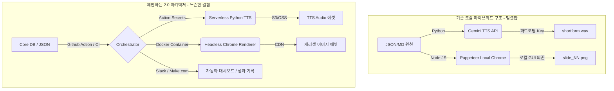

# 🔭 전문가 렌즈 감찰 보고서: 난상토론 (Forest View)

━━━━━━━━━━━━━━━━━━━━━━━━━━
📅 **감찰일:** 2026-05-20
📁 **프로젝트:** 문장군 인스타그램 운영 OS
👥 **참여 전문가:** 
- 💻 **코딩 프로 (Tech Lead / 12년차)**
- 🎨 **UX/UI 디렉터 (Creative Director / 10년차)**
- 📊 **사업가/PM (Growth PM / 10년차)**
- 🔒 **보안 솔루션 엔지니어 (Security Lead / 11년차)**
- 🏗️ **시스템 아키텍트 (Principal Architect / 13년차)**
━━━━━━━━━━━━━━━━━━━━━━━━━━

> **[감찰 전제]**
> 본 보고서는 프로젝트의 성과를 칭찬하지 않으며, 시스템이 안고 있는 잠재적 리스크, 확장 한계, 설계 결함 및 비즈니스 전환 병목을 거시적 관점(숲)에서 분석한 적대적·건설적 비평록입니다.

---

## 👥 5인의 전문가 난상토론 (Panel Discussion)

### 1. 💻 코딩 프로의 비평: "기술 부채와 개발자 온보딩 경험의 부재"

> **"하이브리드 환경의 비표준적 구성과 테스트 부재는 릴리즈 퀄리티를 위협합니다."**

* **개발 환경 파편화:**
  - 현재 이 프로젝트는 **Node.js(JS)**와 **Python**을 동시에 요구하는 복합 환경입니다. Puppeteer로 이미지 렌더링을 하고, Gemini API로 TTS를 생성합니다. 
  - 하지만 Node.js는 `package.json`으로 의존성을 명시한 반면, Python은 `requirements.txt`가 아예 누락되었습니다. 새로운 개발자나 대행사 개발팀이 온보딩할 때 `google-genai` 등 어떤 버전의 패키지를 깔아야 할지 알 수 없으며, 환경 재현성이 심각하게 떨어집니다.
* **Puppeteer 런타임의 불안정성:**
  - `generate_carousel.js`는 Puppeteer를 기본 런타임으로 띄우는데, 로컬 OS의 크롬 브라우저 의존도가 큽니다. Windows 개발환경 외에 Linux나 컨테이너 환경에서 렌더링 서버를 돌릴 경우 샌드박스 설정(`--no-sandbox` 등)이나 폰트 누락으로 인해 즉각 빌드가 터질 구조입니다.
* **자동화 테스트의 전무:**
  - JSON 스키마를 유효성 검사하는 코드도 없고, 렌더링된 PNG 이미지의 정합성(텍스트 잘림 등)을 검증하는 시각적 회귀 테스트(Visual Regression Test) 프레임워크가 아예 없습니다. 배포 직전 사람이 눈으로 보기 전까지는 렌더링 오류를 알 길이 없습니다.

---

### 2. 🎨 UX/UI 디렉터의 비평: "디자인 에디토리얼의 모듈화 실패와 유연성 결여"

> **"도구는 고도화되었는데, 디자이너는 여전히 코드 내부를 뜯어고쳐야 합니다."**

* **하드코딩된 에디토리얼 디자인 구성 요소:**
  - `generate_carousel.js` 내부에 마지막 CTA 슬라이드의 신뢰 배지 3개("실측 기반", "공간 맞춤", "부담 없는")가 마크업 단에서 하드코딩되어 있습니다. 만약 '봄맞이 이벤트'나 '후기 1.5만 개 달성 기념 특가'로 신뢰 배지 메시지를 바꾸려면 Coder가 코드를 직접 수정해야 합니다. 
  - 디자인 시스템 가이드 `INSTAGRAM_CAROUSEL_DESIGN_GUIDE.md` v2.5에서는 완전한 데이터 주도 렌더러를 표방했지만, 핵심 컴포넌트의 일부가 렌더링 코드에 고착화되어 있는 모순이 존재합니다.
* **레이아웃 예외 처리가 배제된 50:50 상하 일괄 분할:**
  - 상하 50:50 레이아웃(상단 텍스트, 하단 이미지)은 기획의 텍스트가 조금만 길어지거나 줄바꿈이 빈번하면 텍스트 박스가 이미지 영역을 침범하거나 가독성이 크게 떨어질 위험이 큽니다. 줄바꿈(`\n`)이 강제되는 수동 기획 구조인데, 디바이스 해상도나 폰트 렌더링에 따른 가변 높이 방어벽(Margin Collapse 방지, flex-basis 비율 조정)이 정밀하게 설계되지 않았습니다.

---

### 3. 📊 사업가/PM의 비평: "깔때기(Funnel) 지표 측정 도구와 CRM 연동의 실종"

> **"15,000개 리뷰와 무료 실측이 무색할 정도로, 비즈니스 깔때기가 깜깜이 상태입니다."**

* **전환 지표 측정(UTM 및 리드 트래킹) 메커니즘 부재:**
  - 인스타그램 콘텐츠의 목표는 `DM 문의`와 `프로필 링크를 통한 무료 실측 예약`입니다. 그러나 최종 발행 에셋인 `caption.txt`에 제공되는 링크 주소는 단순히 "프로필 링크"로 퉁쳐져 있습니다. 
  - 어떤 콘텐츠(002 좁은현관, 003 중문가격 등)를 보고 들어온 사용자가 실제로 전환을 일으켰는지 파악할 수 있는 고유 식별 파라미터(예: UTM 소스 태깅, 전환 전용 숏링크) 기획이 누락되어 성과를 정량 측정할 수 없습니다.
* **수동 성과 추적의 높은 피로도로 인한 운영 포기:**
  - `performance_log.md`와 `experiment_log.md`가 완전한 공백 상태인 이유는, 담당자가 매일 인스타그램 앱에 들어가 도달수, 저장수, DM 전환 여부를 엑셀 형태의 마크다운 표에 하나하나 기입해야 하는 극도의 수동 번거로움 때문입니다. 가벼운 노코드 API(예: Make, Zapier 등)나 Notion 연동을 통한 대시보드 자동 수집 기획이 배제되어, 결국 운영 OS가 아닌 '방치 문서'가 되었습니다.

---

### 4. 🔒 보안 솔루션 엔지니어의 비평: "API 라이프사이클 관리 실패와 크레덴셜 유출 위험"

> **"보안 사고는 언제나 '나만 아는 파일'에 하드코딩된 API 키에서 시작됩니다."**

* **API Key의 파편화된 방치:**
  - `.env`에 적어둔 키를 로드하지 않고 `generate_tts.py` 파일 내에 직접 API 키를 기입해 둔 것은 명백한 보안 불감증입니다. 만약 이 프로젝트 소스코드가 퍼블릭 Git 저장소에 잘못 올라가거나 외주 대행사에 코드 통째로 공유된다면, Gemini API 사용권이 그대로 도용당해 비용 폭탄을 맞을 수 있습니다.
* **로컬 파일 권한 및 안전장치 누락:**
  - CLI 환경에서 구동될 때 `.env`에 정의된 로컬 민감 변수들이나 scripts 내부 파일들에 대한 최소 권한 가이드라인이 없습니다. 런타임 내에서 쉘 명령어로 입력을 처리하는 파일들이 있어, 만약 외부 입력 인자 파싱 시 이스케이프 처리가 안 되면 원격 코드 실행(RCE) 등 잠재적 위협이 존재합니다.

---

### 5. 🏗️ 시스템 아키텍트의 비평: "런타임 복잡성과 모놀리식 콘텐츠 패키지의 한계"

> **"확장 불가능한 결합 구조. 콘텐츠 개수가 100개를 넘어가는 순간 마비될 구조입니다."**

* **모놀리식 패키지 파일(`shortform_package.md`)의 한계:**
  - AI 콘텐츠 엔진이 `shortform_package.md`라는 1개 파일에 스크립트, 연출안, TTS 텍스트, 자막, 캡션, DM 가이드까지 몰아넣는 설계를 선택했습니다. 
  - 이는 단건 제작에는 직관적일지 모르나, 나중에 자막만 다국어로 번역하거나, TTS 대본만 모아서 음성 합성기에 다시 넘기거나, DM 응대 가이드만 모아 상담원용 매뉴얼 시스템에 임포트하려 할 때 파싱 복잡도를 엄청나게 유발합니다. 관심사 분리(Separation of Concerns) 관점에서 데이터 파이프라인 설계가 이루어지지 않았습니다.
* **의존성 파이프라인의 종속성:**
  - 이미지 생성 엔진이 로컬의 Puppeteer를 띄워 HTML을 렌더링하고 이미지로 캡처하는 과도한 하드웨어 리소스 구조를 가집니다. 만약 자동화 파이프라인을 구축해 일 50개의 캐러셀을 생성해야 한다면, 로컬 스레드가 Puppeteer 브라우저 인스턴스 오픈/클로즈로 점유되어 대기시간이 극도로 길어집니다. 이를 분리된 headless 서비스나 SaaS형 이미지 생성 API로 대체할 수 있는 구조적 완충 지대가 없습니다.

---

## ━━━ 🏗️ 아키텍처 개선 방향 제안 ━━━

---

## ━━━ 각 분야별 핵심 액션 플랜 ━━━

1. **💻 기술 부채 청산:** 
   - 루트에 Python 의존성 설정을 명시하는 [requirements.txt](file:///c:/Users/hjh/안티그래비티/문장군%20인스타그램/requirements.txt)를 즉시 생성하고, 스크립트 실행에 필요한 패키지 버전(예: `google-genai`, `python-dotenv`)을 규격화하십시오.
2. **🎨 디자인 가용성 확보:** 
   - `generate_carousel.js` 내에 하드코딩된 CTA 신뢰 배지 텍스트를 [`CAROUSEL_TOKENS.json`](file:///c:/Users/hjh/안티그래비티/문장군%20인스타그램/CAROUSEL_TOKENS.json) 혹은 JSON 데이터 필드로 이관하여 디자이너가 코드 수정 없이 JSON 수정만으로 레이아웃을 통제할 수 있게 하십시오.
3. **📊 비즈니스 전환 가시성 확보:** 
   - `caption.txt` 내에 들어가는 링크에 고유 소스코드(예: `utm_source=instagram&utm_medium=carousel&utm_campaign=002_narrow`)를 자동 주입하여 실제 인스타 유입을 구글 애널리틱스나 예약 폼에서 추적할 수 있게 엔지니어링하십시오.
4. **🔒 보안 가드 강화:** 
   - Python 코드 내 하드코딩된 API Key 선언을 즉시 삭제하고, `python-dotenv` 라이브러리를 통해 로컬 환경의 `.env` 변수를 로드하도록 리팩토링하십시오.
5. **🏗️ 아키텍처 분리:** 
   - 장기적으로 `shortform_package.md` 내부의 각 영역을 개별 마크다운 파일(예: `script.md`, `dm_reply.md`, `captions.md`)로 쪼개어 자동화 파서가 손쉽게 파이프라인을 태울 수 있도록 포맷을 파편화하십시오.
